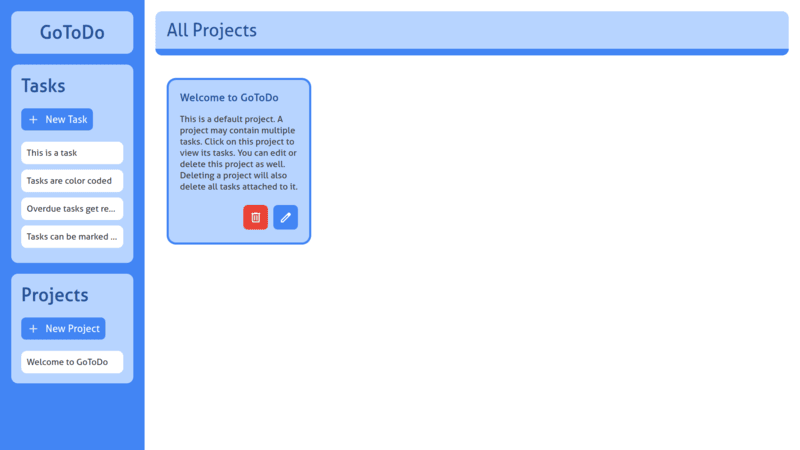

# GoToDo

A dynamic task management application built with vanilla JavaScript, focusing on modular design and clean coding principles. GoToDo helps you organize tasks with projects, priorities, and due dates with an intuitive interface.

## Features

- **Project Organization**:

   - Projects provide a grouped view of related tasks
   - Tasks may or may not be assigned to specific projects
   - Project deletion cascades to associated tasks
   
- **Task Handling**

   - Tasks are automatically color-coded based on due dates
   - Overdue tasks are rescheduled to the current date
   - Due dates and priority information is display on the tasks
 
- **Date Color Coding**

  - Red: Due today
  - Yellow: Due tomorrow
  - Blue: Future dates
   
- **Auto-Rescheduling**
 
  - Overdue tasks are automatically rescheduled to current date
   
- **Local Storage**
 
  - Data storage is persistent across browser sessions
  
- **Quick Access** 
  
  - GoToDo section displays upcoming tasks due today or tomorrow
  - Projects and tasks are accessible from scrollable sidebar lists

## Screenshots

### All Projects View


### All Tasks View


### Upcoming Tasks View


## Technologies Used

- Vanilla JavaScript (ES6+)
- HTML5
- CSS3
- Local Storage API
- Webpack (Module Bundling)
- npm

## Directory Structure

```
src/
├── js/
│   ├── index.js   # Entry point    
│   ├── contentRenderer.js   # Main content rendering
│   ├── events.js           # Event handlers
│   ├── projects.js         # Project management
│   ├── tasks.js           # Task management
│   ├── sidebarRenderer.js  # Sidebar UI handling
│   └── utils.js           # Utility functions
├── styles/
│   └── styles.css         # Application styling
└── data/
    ├── projects.json      # Sample project data
    └── tasks.json         # Sample task data
```

## Setup and Installation

1. Clone the repository
```bash
git clone https://github.com/miryarik/todo.git
```

2. Install dependencies
```bash
npm install
```

3. Run development server
```bash
npm run dev
```

4. Build for production
```bash
npm run build
```

## Possible Enhancements

- Task filtering and search functionality
- Task categories and tags
- Drag-and-drop task organization
- Data export / import capabilities
- Task completion statistics / records

## Contributing

Contributions are welcome! Please feel free to submit a Pull Request.

## License

This project is licensed under the MIT License - see the LICENSE file for details.